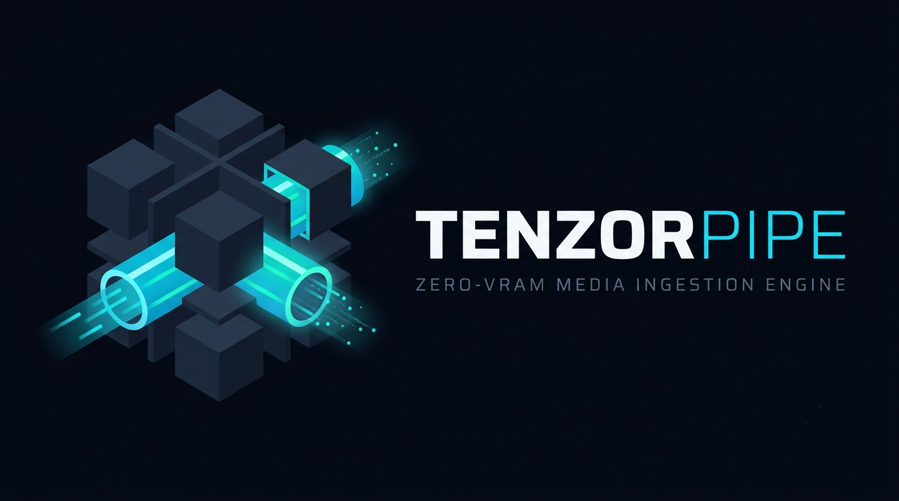
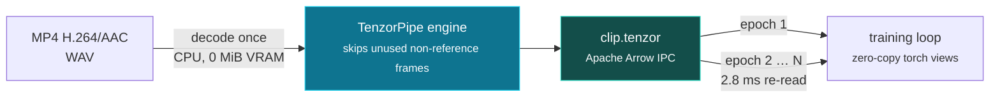

<p align="center">
  
</p>

<p align="center">
  
  
  
  
  
</p>

MP4 H.264/H.265/AAC-LC and WAV → synchronized RGB/CHW and Log-Mel tensors in batched
Apache Arrow IPC (`.tenzor`), decoded on the CPU with no FFmpeg or CUDA runtime dependency.
Decode once, then memory-map the tensors for every training epoch that follows.

**▶ [Watch the 25-second explainer](assets/tenzorpipe_demo.mp4)** — side-by-side against GPU
decoders, narrated, with the numbers measured on the machine that built it.

## Quickstart

```sh
pip install https://github.com/jay-showforge/tenzorpipe/releases/download/v0.3.1/tenzorpipe-0.3.1-cp39-abi3-manylinux_2_34_x86_64.whl  # 1. install
python -c "import tenzorpipe as tp; tp.ingest('clip.mp4', 'clip.tenzor')"   # 2. decode once
python -c "import tenzorpipe as tp; d=tp.load('clip.tenzor'); print(len(d), d[0]['video'].shape)"  # 3. train
```

**Install** (Linux x86-64 or ARM64, CPython 3.9+; the wheels below need glibc 2.34+, see [docs/PACKAGING.md](docs/PACKAGING.md) for older distributions):

```sh
# Linux x86-64, with the PyTorch extra:
pip install "tenzorpipe[torch] @ https://github.com/jay-showforge/tenzorpipe/releases/download/v0.3.1/tenzorpipe-0.3.1-cp39-abi3-manylinux_2_34_x86_64.whl"
# Linux ARM64 (Jetson, Graviton, ARM servers):
pip install "tenzorpipe[torch] @ https://github.com/jay-showforge/tenzorpipe/releases/download/v0.3.1/tenzorpipe-0.3.1-cp39-abi3-manylinux_2_34_aarch64.whl"
# or from source, needing Rust 1.98.1 (plus NASM on x86-64):
pip install ".[torch]"
```

**Ingest an MP4 and read it as PyTorch tensors:**

```python
import tenzorpipe as tp
tp.ingest("clip.mp4", "clip.tenzor")                # decode once: 224×224 RGB + 64-band Log-Mel every 0.5 s
with tp.load("clip.tenzor") as data:                # memory-mapped Arrow, zero-copy tensor views
    for batch in data.iter_batches():
        video, mel = batch["video"], batch["audio"]  # float32 [B,3,224,224] and [B,50,64]
```

**Command line** (the wheel installs a `tenzor` binary):

```sh
tenzor -i clip.mp4 -o clip.tenzor                                     # defaults: 224px, 0.5 s epochs
tenzor -i clip.mp4 -o small.tenzor --resolution 160 --window-sec 0.25 --video-workers 4
tenzor -i clip.mp4 -o clip.tenzor --profile --quiet                   # stage timers, no diagnostics
tenzor --help
```

**Reproduce the comparison yourself** (writes `benchmark_results.json`):

```sh
python scripts/generate_benchmark_assets.py     # 10 s 1080p30 H.264/AAC test clip
python scripts/run_side_by_side_demo.py         # measures TenzorPipe vs TorchCodec CUDA vs FFmpeg
python scripts/produce_demo_video.py            # narrated video from those measurements
```

**Benchmark highlights.** One 20 s 1080p30 H.264 clip, Intel i5-14400F + RTX 5060 8 GB under
WSL2, 50 measured iterations each. All tables, methods and caveats are in [BENCHMARKS.md](BENCHMARKS.md).

**Pass 1 — ingest from MP4.** Every contender decodes the clip and produces 224² tensors. This is
a like-for-like decode race, and TenzorPipe does not win it:

| | TenzorPipe 0.3.0 | FFmpeg pipe | NVIDIA DALI | TorchCodec (CUDA) |
|---|---:|---:|---:|---:|
| Ingest one clip into 224² tensors | 646 ms¹ | 554 ms | 442 ms | **276 ms** |
| GPU memory used | **0 MiB** | 0 MiB | 822 MiB | 650 MiB |

**Pass 2 and later — re-read the cache.** TenzorPipe writes a `.tenzor` file on the first pass and
memory-maps it afterwards. The other three have no cache and decode the MP4 again every epoch:

| | TenzorPipe 0.3.0 | FFmpeg pipe | NVIDIA DALI | TorchCodec (CUDA) |
|---|---:|---:|---:|---:|
| Each later epoch over the same clip | **2.8 ms** re-read² | 554 ms | 442 ms | 276 ms |

**Total for N epochs.** Arithmetic from the two measured passes above, not a separate measurement:

| Epochs | TenzorPipe | FFmpeg pipe | NVIDIA DALI | TorchCodec (CUDA) |
|---:|---:|---:|---:|---:|
| 1 | 646 ms | 554 ms | 442 ms | **276 ms** |
| 2 | **649 ms** | 1.11 s | 884 ms | 552 ms |
| 3 | **652 ms** | 1.66 s | 1.33 s | 828 ms |
| 10 | **671 ms** | 5.54 s | 4.42 s | 2.76 s |
| 50 | **783 ms** | 27.7 s | 22.1 s | 13.8 s |

TenzorPipe loses the single pass and leads from the third epoch against every contender, or the
second against FFmpeg and DALI. Nothing prevents those tools from writing a tensor cache of their
own — the claim is that TenzorPipe ships one that is byte-exact and reproducible, not that caching
is unavailable elsewhere.

**Where each design wins.** Dedicated silicon beats a CPU decoder at raw first-pass throughput,
and NVDEC-backed readers (DALI, TorchCodec) will keep that lead on single-stream jobs. TenzorPipe
competes on operational properties instead:

- **0 MiB VRAM.** The decode path allocates no GPU memory at all, so it never contends with the
  model for an 8 GB card, and the same binary runs on hosts with no GPU.
- **Bounded host memory that does not grow with clip length.** Engine RSS is 87 MiB at one worker
  on the 1080p clip above, and about 500 MiB at eight. On a 2-core box a 330-second 640×360 clip
  holds at 58 MiB and a 22-minute one at 119 MiB.
- **Amortised across epochs.** Decode once; every later epoch is a memory-mapped read.
- **Self-contained.** No FFmpeg, no CUDA, no system codec packages — one static binary plus a
  wheel, which is what makes air-gapped and embedded deployment straightforward.

If your workload is a single pass over each clip on a machine with a spare GPU, use NVDEC and be
happy. TenzorPipe is aimed at repeated passes, GPU-constrained hosts, and deployments where the
dependency footprint is itself the problem.

¹ 625 ms in an earlier run of the same engine, where FFmpeg took 531 ms. The first pass is 7.9×
faster than v0.2.0.

² Measured reading from `/dev/shm` (tmpfs), so it excludes disk I/O entirely and is a floor rather
than a cold-storage figure; cold NVMe re-reads are not yet measured. The cache costs about 23 MiB
for this 20-second clip — 40 epochs × (3×224×224 + 50×64) float32 — or roughly 4 GiB per hour of
1080p footage. That storage is the trade you are making for the re-read speed.

## How it works



The decode happens once. Every epoch after that memory-maps the same contiguous tensors, so the
GPU stays free for the model and the tensors are identical on every run and every worker count.

## Target architectures & concrete use cases

**🤖 Edge robotics & autonomous perception** — Jetson, drones, humanoids
Unified-memory boards make every decoder byte a byte the model cannot have. TenzorPipe decodes on
the CPU with **0 MiB of GPU allocation**, so NVDEC surfaces and decoder pools never contend with
inference. Contiguous Arrow frames stream straight into spatial networks, conserving battery and
compute bandwidth on the same die.

**🧠 Multimodal LLM & video-language model training**
Ingest the corpus once into `.tenzor`, then re-read video tensors in **single-digit milliseconds**
per clip per epoch. Multi-GPU clusters stay saturated instead of burning cycles re-decompressing
the same MP4s for every pass, and the 0.5 s epoch grid keeps video and Log-Mel audio aligned for
cross-modal attention.

**🛡️ Air-gapped & sovereign pipelines** — defense, medical, regulated data
Fully local execution: no cloud APIs, no network calls, no temporary frame dumps to disk (a
libc-level write audit observed only the final artifact). Output is **bit-exact and
deterministic** — 1,056 regression cases byte-identical to the previous release — which is what
reproducible clinical and evidentiary pipelines require.

**🔎 High-throughput local video indexing & search** — journaling, media ops
Thousands of short clips punish shell-out FFmpeg with process-spawn latency and disk thrashing.
TenzorPipe runs in-process through PyO3 and hands contiguous frame batches directly to local
embedding models; `python/tenzor_batch.py` saturates every core across files
(16 clips in 0.41 s versus 1.95 s sequentially).

**License:** Business Source License 1.1. Production use is permitted for individuals and
organizations whose annual gross revenue, combined with their parents, subsidiaries and affiliates,
is under US$100,000; non-production use is unrestricted. Larger organizations and embedded
hardware/OEM deployments need a commercial license (licensing@tenzorpipe.org). Converts to
Apache-2.0 on 2030-09-16. See [LICENSE](LICENSE).

See **CHANGELOG.md** for 0.3.0 changes. Earlier build, test and benchmark reports are in
docs/releases/.

## Build

Linux x86-64 is the tested target. Install a C/C++ compiler, NASM, and Rust 1.98.1.
On a conventional Debian/Ubuntu host:

```sh
sudo apt-get update
sudo apt-get install -y build-essential nasm ffmpeg strace python3-venv
rustup toolchain install 1.98.1 --profile minimal --component rustfmt,clippy
cargo build --release --locked --workspace
cargo test --locked --workspace --all-targets
cargo install cargo-deny --version 0.20.2 --locked
cargo deny check licenses
```

OpenH264 is compiled from BSD-licensed source. No FFmpeg library or executable is
used by the engine. NASM enables OpenH264's assembly optimizations, including the AVX2
routines (selected at runtime by CPUID) via the vendored `openh264-sys2` build patch
(vendor/openh264-sys2/TENZORPIPE_PATCH.md). A NASM failure now fails the build instead of
silently producing a slower C-only decoder; set `OPENH264_ALLOW_C_FALLBACK=1` to accept one.
The lockfile and local SPS metadata and AAC inverse-transform patches are included.

## Run

```sh
./target/release/tenzor -i fixtures/fixture-h264-aac.mp4 -o example.tenzor
./target/release/tenzor -i fixtures/wav-44100-2ch.wav -o audio.tenzor
./target/release/tenzor -i fixtures/high-bframes.mp4 -o small.tenzor \
  --resolution 160 --batch-epochs 2
```

Output must not already exist. Its name is reserved without overwriting another
file. The engine flushes and syncs data, closes the writer, then reopens the Arrow
file before reporting success. Ordinary errors remove the partial output. The
file is visible while it is being written, but is not readable as completed IPC
until its footer is written; consumers must wait for exit status 0. A hard kill
can leave an incomplete file, which must be removed before retrying. No intermediate
decoded media files are created. Input media must remain immutable during processing.

## Execution and profiling

Concurrent audio/video processing is the default. The collector alone writes Arrow.

```sh
./target/release/tenzor -i fixtures/high-bframes.mp4 -o concurrent.tenzor --profile
./target/release/tenzor -i fixtures/high-bframes.mp4 -o serial.tenzor --execution sequential
./target/release/tenzor -i fixtures/high-bframes.mp4 -o rendezvous.tenzor --queue-mib 0
```

`--queue-depth` defaults to 2 (1–4 allowed). `--queue-mib` defaults to 4 (0–64).
Capacity is reduced to fit the combined audio/video queued payload budget; it is
independent of Arrow batch size. Capacity zero uses rendezvous channels. Decoder
state, worker/collector working tensors, allocator overhead and Arrow batches are
additional bounded memory, not included in that payload budget. Default 224/0.5s
queues use 1,229,824 payload bytes across both tracks.

`--quiet` (`-q`) suppresses the diagnostic lines on stderr (decoder mode and the per-video
summary); errors and `--profile` output are still reported. `--profile` prints JSON on stderr
with wall-clock stage durations. Audio source
reading/decoding/downmix is excluded from the resampling timer. Channel send/receive
waits are separate. Stage durations overlap across threads and are not CPU time or
an additive decomposition of total latency. Frame copying, scheduling and other
small overheads remain outside individual timers. Profiling itself has overhead.

Worker errors cancel the pipeline, wake blocked channels and join every worker.
Worker/collector Rust panics unwind into reported errors. Native codec crashes,
process kills and hardware/storage failures are not recoverable worker errors.

The normal build accepts only `--decoder-threads 0`. The source-only
`experimental-decoder-threads` feature permits 1/2/4 for controlled experiments;
2 and 4 hung on a tested Baseline fixture even after correcting pre-initialization
configuration. Do not enable that feature in deployments. See docs/releases/v0.1.9/CONCURRENCY_REPORT.md.

## Parallel video decoding

`--video-workers N` decodes H.264 with N independent OpenH264 instances over
IDR-aligned chunks. `1` runs the single-decoder path. `0` and the **default** (since
0.3.0) pick `available_parallelism()`, clamped to 1–16 and further capped at
the clip's number of chunks. The default falls back to one decoder when the experimental
`--decoder-threads` is set.

Each worker adds OpenH264 picture buffers: about 48 MiB per extra worker at 1080p (about
14 MiB at 360p), so a 16-thread host can reach ~500 MiB of engine RSS on 1080p input. Pass
`--video-workers 1` (or a small N) where RAM matters more than latency, and always pass an
explicit value when running several `tenzor` processes at once (see
docs/FILE_BATCHING.md and `python/tenzor_batch.py`). BENCHMARKS.md has current measurements.

```sh
./target/release/tenzor -i fixtures/long-330.mp4 -o par.tenzor --profile          # auto workers
./target/release/tenzor -i fixtures/long-330.mp4 -o small.tenzor --video-workers 1 # lowest RAM
```

- Chunks start only at access units whose VCL NALs are all IDR slices and whose
  presentation times follow every earlier access unit. Sync samples that are not
  IDR (for example open-GOP I-frames) are never used as cut points.
- Epoch-to-picture selection is computed once from container timing with the same
  midpoint and tie rules, so output is byte-identical to the single-decoder path.
- A worker may only start chunk `c` while `c < next_chunk_to_emit + window`
  (`window = N + 1`, reduced to fit `--video-buffer-mib`, default 64). Decoded
  tensors, including the chunk being emitted, are bounded by `window × largest chunk`.
  The admission credit is returned only after emission completes.
- `--chunk-target-ms` (default 2000) merges short GOPs into larger chunks.
- The path falls back to the single decoder, logging `video_mode=single_fallback
  reason=...`, for clips with fewer than two valid chunks, duplicate presentation
  timestamps, a budget too small for two in-flight chunks, or excessive planning metadata.
- Planning has a conservative 32 MiB vector-payload allowance and falls back before
  allocation if the sample count would exceed it. This is separate from tensor buffers.
- On Linux, indexing releases mapped source pages every 128 samples so residency
  does not grow with input file size before decoding begins.
- Each worker adds decoder state and allocator overhead to RSS. Queue, chunk and
  batch budgets are separate. See BENCHMARKS.md for current measured RSS.
- Worker and emitter panics cancel before scoped joins; partial thread-start
  failures also trigger cancellation. Native faults remain process-level failures.

### Skipping unused non-reference pictures

Only the picture nearest each epoch start is converted, so most decoded pictures are
discarded. An access unit whose slices all have `nal_ref_idc == 0` (typically
non-reference B-frames) cannot affect any other picture. If no epoch selects it, it is now
never sent to OpenH264. Output is byte-identical to decoding everything; on the 1080p
benchmark clip 265 of 600 access units are skipped. The log reports
`skipped_nonref=N`, and `--no-skip-nonref` restores full decoding.

- Selection is decided before decoding. The chunked path uses its up-front plan; the
  single-decoder path runs a second bounded presentation lookahead. If that lookahead hits
  a metadata error, skipping stops and the normal path reports the error in its usual order.
- Only units containing non-reference non-IDR slices plus SEI, access-unit delimiters or
  filler are skipped. Parameter sets, end-of-sequence/stream NALs, data partitions and
  malformed units are always decoded, so framing errors are reported as before.
- Trade-off: corrupt *slice data* inside a skipped picture is no longer detected, because
  that picture is never decoded. Use `--no-skip-nonref` to validate every picture.

## H.265 / HEVC

MP4 files with an H.265 video track are decoded by `rusty_h265` (Apache-2.0, pure Rust, no
FFI) and follow the same selection, resize and colour path as H.264, so the tensor contract
is unchanged.

```sh
./target/release/tenzor -i clip-hevc.mp4 -o clip.tenzor
```

Scope: **Main profile, 8-bit 4:2:0**. Main 10, Main Intra / Still Picture, the range and
screen-content extensions, interlaced coding and 4:2:2 / 4:4:4 are refused before decoding,
naming the profile and the `ffmpeg` command that converts the file.

`--video-workers`, `--chunk-target-ms`, `--video-buffer-mib` and `--no-skip-nonref` work the
same way as for H.264:

- **Chunks start at IRAP access units.** An IDR resets the decoder outright; a CRA does too,
  but the RASL pictures that follow it present *before* it and reference the previous GOP, so
  each chunk decodes through the next chunk's IRAP and its RASL run and hands out only the
  pictures inside its own presentation interval. Open-GOP encodes — x265's default, where the
  only IDR is the first frame — parallelise because of this.
- **Unused sub-layer non-reference pictures are never decoded.** A sub-layer non-reference
  picture at the stream's highest `TemporalId` cannot be referenced by anything, so when no
  epoch selects it the access unit is skipped. Typical B-pyramid encodes skip about 60% of
  their access units; `--no-skip-nonref` decodes everything.
- Every worker count, chunk size and skip setting produces identical tensors, and the chunk
  plan falls back to one decoder (logging the reason) when a clip cannot be partitioned.

`scripts/test_hevc_fidelity.py` compares the tensors against an independent FFmpeg decode and
checks that identity.

## Audio execution

Concurrent mode now separates audio decoding from resampling/Mel processing.
A bounded 32-chunk queue preserves PCM order. Its queued mono payload is at most
128 KiB for the supported AAC access units or 512 KiB for WAV chunks; in-flight
chunks and decoder/resampler state are additional memory. The resampler retains
consumed samples only until its next 32,768-sample drain threshold.

`--no-audio-decode-thread` keeps decoding inline. Sequential execution also decodes
inline. Huffman lookup, bit reads, exact formula tables and reused IMDCT buffers
preserve the previous arithmetic and tensor values. The new `audio_source_wait`
profile timer measures consumer wait; `audio_source` is decode/downmix work on its
own thread. Stage timers overlap and cannot be added to recover wall time.

### Short audio tails and unsupported inputs

Container durations are rounded and editors trim tails, so a file's audio can end a
fraction of a millisecond before the duration its container declares. The engine pads
gaps up to `--audio-tail-tolerance-ms` (default 25 ms) with silence, prints one note on
stderr and does not count the padded frames as valid audio. `0` requires an exact match;
longer gaps remain an error that names the gap and the fix.

```sh
./target/release/tenzor -i clip.mp4 -o clip.tenzor --audio-tail-tolerance-ms 50
```

Unsupported inputs name what was found and the conversion command, for example a
H.265/HEVC video track, Opus or HE-AAC audio, or a non-MP4/WAV extension:

```
Error: video track is H.265/HEVC; TenzorPipe decodes H.264/AVC. Convert with
`ffmpeg -i INPUT -c:v libx264 -crf 18 -preset veryfast -c:a copy OUTPUT.mp4`.
```

## ARM64 (Jetson, Graviton, Apple Silicon)

The engine builds and runs on aarch64 with no source changes and no extra flags:

```sh
cargo build --release --locked        # on the ARM machine
```

- **H.264** uses the vendored OpenH264's ARM64 **NEON assembly** (`codec/*/arm64/*.S`,
  selected by `build.rs` from the target architecture and compiled by the C compiler).
  NASM is an x86-only build dependency and is not needed on ARM.
- **H.265** (`rusty_h265`) and its kernels (`rusty_h265-accel`) have NEON paths; NEON is
  mandatory on aarch64, so there is no runtime probe. RustFFT's NEON backend is on by
  default for the Mel stage. The AAC decoder is scalar Rust on every architecture.
- **Determinism is measured, and its scope differs by tensor.** Within one architecture the
  engine is bit-exact: identical bytes for any worker count, chunk size or repeat, verified
  21/21 on x86-64 and 21/21 on real ARM64 hardware against per-architecture digests in
  `evidence/arch-digests-<machine>.json`.

  Across architectures, **video tensors are bit-identical**. H.264 and H.265 decoding are exact
  by specification and the resize and colour conversion are integer and scalar, so
  `scripts/test_arch_tolerance.py` gates video at zero difference and treats any drift as a
  defect. **Log-Mel audio is not bit-identical**, because RustFFT selects AVX2 on x86-64 and
  NEON on aarch64. Measured across all 21 cases on GitHub's runners, decoding byte-identical
  fixtures:

  | x86-64 vs aarch64, log-Mel coefficients | |
  |---|---|
  | values that differ at all | 4–95%, depending on the clip |
  | median difference | 2e-4 log10 units (~0.05% in amplitude) |
  | 99.9th percentile | 1.4e-2 log10 units |
  | worst case | 2.8e-2 log10 units (~6.6% in amplitude) |

  That is a numerical difference from a different FFT backend, not rounding at the scale of a
  ULP, and it is spread across the spectrogram rather than confined to quiet bins. The gate
  bounds it at 5e-2 so a regression is caught. If you need identical Mel bytes across machines,
  keep ingestion on one architecture; mixing architectures is safe for the video path.

```sh
python3 scripts/test_arch_identity.py             # bit-exactness on this architecture
python3 scripts/test_arch_identity.py --record    # re-record this architecture's digests
python3 scripts/test_arch_tolerance.py --dump ref # on one machine, then on the other:
python3 scripts/test_arch_tolerance.py --compare ref
```

Without ARM hardware, the part of the port that can actually break — the per-architecture
assembly and the `build.rs` selection around it — is checkable from an x86-64 box:

```sh
sudo apt-get install -y g++-aarch64-linux-gnu qemu-user-static ffmpeg
bash scripts/check_arm64_openh264.sh
```

It cross-compiles the vendored OpenH264 with its NEON assembly, decodes the fixtures under
emulation, and compares the decoded pictures against the host build's, which must match
exactly. `scripts/release_gates.sh` runs it when those tools are installed and skips it
otherwise.

ARM64 wheels build the same way as x86-64 ones:

```sh
WHEEL_TARGET=aarch64-unknown-linux-gnu bash scripts/build_wheel.sh
COMPATIBILITY=manylinux_2_28 WHEEL_TARGET=aarch64-unknown-linux-gnu bash scripts/build_wheel.sh
```

Benchmarks are per-machine: compare an ARM number only against another ARM number. The
`--profile` JSON records `"arch"` so evidence files say which machine produced them.

## Tensor contract

One row represents an epoch start, normally every 500 ms. Each row contains:

| Column | Meaning |
|---|---|
| `timestamp_ms` | Epoch start on the movie presentation timeline |
| `audio_valid_frames` | Number of 10 ms hops whose start is inside the audio timeline |
| `video_timestamp_ms` | Presentation timestamp of the selected source frame; absent for audio-only input |
| `video_tensor` | Float32 `[3,H,W]`, RGB, normalized to `[-1,1]`; absent for audio-only input |
| `audio_mel_tensor` | Float32 `[window_ms/10,64]`, frame-major Log-Mel |

Schema metadata supplies shapes, version, source-presence flag, audio DSP settings,
video matrix/range, normalization, sampling, and resize rules. A silent-video file
has `has_audio=false`, zero valid audio hops, and a documented `-10` placeholder;
it must not be interpreted as observed audio. WAV and AAC-only MP4 omit video.

Video selection is nearest presentation frame to each epoch start, with earlier
frames winning ties. Every compressed access unit is decoded, including P/B
frames; decoder output is reordered by presentation timestamps in a capped queue.
SPS/PPS initialize OpenH264. Strict AVCC-to-Annex-B conversion rejects truncated
NAL lengths. Simple MP4 edit lists account for B-frame composition offsets, AAC
priming, and initial delay. The final video frame is repeated through an audio tail.
Only epoch-selected pictures are converted and resized. A bounded 34-timestamp
metadata lookahead preserves midpoint ties without copying unselected pictures.
Resize uses nearest sampling with aligned corners and square stretching.

Audio uses an arithmetic mean across channels, 16 kHz resampling with a 129-tap
Blackman-windowed sinc and 1,024 fractional phases, a symmetric 400-sample Hann
window, 160-sample hop, 64 triangular HTK Mel bands over 0–8 kHz, unnormalized FFT
power, and `log10(power + 1e-10)`. STFT windows start at each hop (not centered).
Right-edge samples are zero-padded. Pure silence has feature value `-10`, not zero.
The final epoch includes padded rows; use `audio_valid_frames` as its mask.

Resolution defaults to 224 and accepts 32–1024. Window lengths accept 0.05–10 s
in exact 10 ms increments. Batch size accepts 1–1024 epochs with a 256 MiB tensor
payload ceiling. MP4 index allocation is capped at 16 MiB; over-limit inputs fail.

## Python / PyTorch

The `tenzorpipe` package runs the engine in-process through PyO3 (the GIL is released while
decoding) and reads the output as zero-copy PyTorch tensors. One abi3 wheel supports
CPython 3.9+ on Linux x86-64 with glibc 2.34 or newer.

```sh
pip install "dist/tenzorpipe-0.3.1-cp39-abi3-manylinux_2_34_x86_64.whl[torch]"  # built wheel
pip install ".[torch]"                                                         # from source
pip install "tenzorpipe[torch]"                                                # once published on PyPI
```

```python
import tenzorpipe as tp

info = tp.ingest("fixtures/high-bframes.mp4", "example.tenzor", resolution=160)
with tp.load("example.tenzor") as data:
    print(info["epochs"], data.video_shape, data.audio_shape)
    for batch in data.iter_batches():
        print(batch["timestamp_ms"], batch["video"].shape, batch["audio"].shape)
```

`tp.ingest()` accepts the CLI options as keyword arguments (`video_workers`, `window_sec`,
`batch_epochs`, `skip_nonref=False`, ...); options left unset use the CLI defaults, because the
arguments are parsed by the same definition. It is silent by default: pass `verbose=True` to see
the engine's stderr diagnostics, and `profile=True` to get stage timers back as `info["profile"]`. Failures raise `tenzorpipe.TenzorError` and
remove the partial output. The wheel also installs the `tenzor` command. Without the
`torch` extra, read files with PyArrow (`data.reader`, or `pyarrow.ipc.open_file`).

Building from source (`pip install .`) needs Rust 1.98.1 and NASM; `scripts/build_wheel.sh`
builds the release wheel and smoke-tests it in fresh virtual environments. Wheels for older
glibc (`manylinux_2_28`, `manylinux_2_17`) are covered in [docs/PACKAGING.md](docs/PACKAGING.md).

`iter_batches()` visits the whole file; `get_batch(0)` is just one batch.
`copy=False` wraps read-only Arrow/NumPy buffers without copying tensor payloads.
PyTorch cannot enforce read-only storage: do not modify these tensors, and keep
owners alive while using them. Use `copy=True` when applying in-place transforms.
No GPU transfer is zero-copy; moving to CUDA allocates GPU storage normally.

## Reproduce verification and benchmarks

```sh
# After the build/test dependencies above are installed (plus FFmpeg for test media):
bash scripts/release_gates.sh          # full 0.3.0 gates, ~25 minutes
QUICK=1 bash scripts/release_gates.sh  # everything except the byte-identity matrix
```

The gates build and test the workspace, run the vendored AAC tests, fmt, clippy and the
license check, compare 1,056 conversions byte for byte against the v0.2.0 release binary
(`scripts/test_skip_identity.py`), run the existing regression suites on a scratch copy of the
repository, and build and smoke-test the wheel. Logs go to `evidence/v0.3.0/`. The comparison
binaries in `reference/bin/` (v0.1.6, v0.1.8, v0.1.9, v0.2.0) are regression oracles; deploy
`bin/tenzor-linux-x86_64` or your own 0.3.0 build. Allow roughly 15 GiB free for generated
test outputs. `scripts/reproduce.sh` is the historical v0.2.0 EPYC evidence pipeline.

Competitor benchmarks (DALI, TorchCodec, FFmpeg) live in `bench/`; see BENCHMARKS.md.

Test outputs default to `out/`. Set `TENZOR_OUTPUT_ROOT=/tmp/tenzor-artifacts`
to choose another output filesystem. Final recorded runs used this override after
workspace outputs failed delayed rereads with both the unchanged old and new
binaries; the local temporary output path passed repeated publication checks.

The media is generated locally with FFmpeg and consists of test patterns,
synthetic tones, and a flash/beep alignment clip. Short fixtures and selected
reconstructed images are included. Long fixtures and large benchmark datasets
are regenerated rather than bundled. FFmpeg is an independent test/oracle and
baseline tool only. See reports for exact commands, environment, measurements,
and the independently verified scope; untested codecs are not advertised.

Historical specifications in `docs/SOURCE_SPEC_v0.1.2.md` are design history,
not claims about the measured performance or supported formats of this release.
